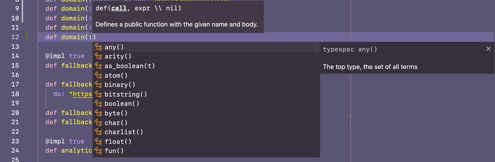

# Discover Panel

Discover Panel is an extension that provides alternative UX for exploring APIs while coding. Its goal is to replace standard widget/popup based UI for API explorations - autocomplete and tooltips. It plugs into built-in VSCode APIs so it should work with any programming language - information displayed in the panel is taken from specific extensions you are using for given programming language.


## Why?

In general I believe into providing developers with editor UX that's not disruptive or intrusive - I strongly believe into adding virtual enhancements to editor buffer. This trend is clearly present in my other projects like [Ionide-F#](https://marketplace.visualstudio.com/items?itemName=Ionide.Ionide-fsharp) where we have whole set of various "virtual" type information hints, or in [GitHub Copilot](https://copilot.github.com/) where we present suggestions as "ghost" text.

The idea behind Discover Panel was created after one of my colleagues has sent me this image:


On the one hand, all information presented in those popups is useful in some scenarios - tooltips, and autocomplete have huge value for API discoverability. On the other hand, this is clearly intrusive - it basically covers all code the developer was working on in this given moment. As mentioned above, I'd rather see some kind of inline, virtual suggestion here (in style of GitHub Copilot suggestions). However, disabling autocomplete and tooltip widgets creates an issue for the API discoverability - you no longer can just see what functions are types are in given module/namespace or what some functions that you use in code does.
And hopefully, that's exactly the problem that can be solved by Discover Panel.

## Suggested VSCode settings

- You can disable automatic showing of tooltip by setting `editor.hover.enabled` to `false`. Tooltip can still be triggered by running `Show Hover` command

- You can disable automatic showing of autocomplete widget by using following settings. Autocomplete widget can still be triggered by running `Trigger Suggest`:

```json
"editor.quickSuggestions": {
    "other": true,
    "comments": false,
    "strings": false
  }
```

## How to contribute

_Imposter syndrome disclaimer_: I want your help. No really, I do.

There might be a little voice inside that tells you you're not ready; that you need to do one more tutorial, or learn another framework, or write a few more blog posts before you can help me with this project.

I assure you, that's not the case.

This project has some clear Contribution Guidelines and expectations that you can [read here](CONTRIBUTING.md).

The contribution guidelines outline the process that you'll need to follow to get a patch merged. By making expectations and process explicit, I hope it will make it easier for you to contribute.

And you don't just have to write code. You can help out by writing documentation, tests, or even by giving feedback about this work. (And yes, that includes giving feedback about the contribution guidelines.)

Thank you for contributing!

## Contributing and copyright

The project is hosted on [GitHub](https://github.com/ionide/Discover-Panel) where you can [report issues](https://github.com/ionide/Discover-Panel/issues), participate in [discussions](https://github.com/ionide/Discover-Panel/discussions), fork
the project and submit pull requests.

The library is available under [MIT license](LICENSE.md), which allows modification and redistribution for both commercial and non-commercial purposes.

Please note that this project is released with a [Contributor Code of Conduct](CODE_OF_CONDUCT.md). By participating in this project you agree to abide by its terms.

## Our Sponsors

Discover Panel is released as part of Ionide organization - OSS organization focused on building cross platform, developer tools.

You can support Ionide development on [Open Collective](https://opencollective.com/ionide).

### Partners

<div align="center">

<a href="https://lambdafactory.io"></a>

</div>

### Sponsors

[Become a sponsor](https://opencollective.com/ionide) and get your logo on our README on Github, description in the VSCode marketplace and on [ionide.io](https://ionide.io) with a link to your site.

<div align="center">
    <a href="https://ionide.io/sponsors.html">
        
        <br/>
        
    </a>
</div>
